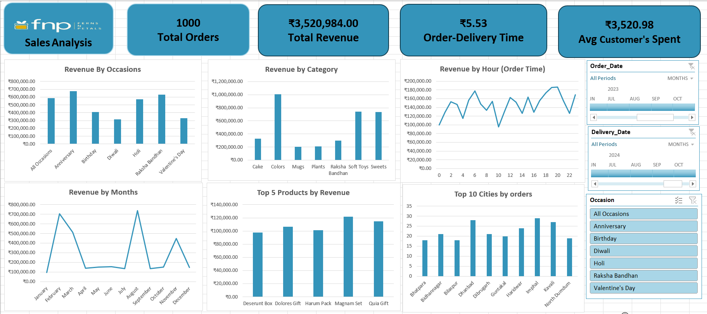

# 📊 FNP Sales Analysis Dashboard

This project presents a comprehensive **Sales Analysis Dashboard** for [Ferns N Petals (FNP)](https://www.fnp.com/), created using Microsoft Excel with PivotTables, PivotCharts, slicers, and custom visuals to analyze sales data across different dimensions such as occasion, category, time, product, and geography.

 <!-- Replace with the actual path if hosted -->

---

## 📌 Overview

The dashboard provides insights into customer purchasing behavior and sales performance by analyzing:

- Total Orders
- Total Revenue
- Average Customer Spend
- Average Order-to-Delivery Time

---

## 🔍 Key Visuals & Insights

### 1. **Revenue by Occasion**
Visualizes total revenue generated from different occasions like Anniversaries, Birthdays, Diwali, etc.

### 2. **Revenue by Category**
Breaks down revenue by product categories such as Cakes, Plants, Soft Toys, etc.

### 3. **Revenue by Hour (Order Time)**
Analyzes customer ordering patterns throughout the day.

### 4. **Revenue by Month**
Highlights seasonal trends and monthly performance.

### 5. **Top 5 Products by Revenue**
Shows best-selling products based on total revenue generated.

### 6. **Top 10 Cities by Orders**
Displays cities with the highest number of customer orders.

### 7. **Slicers for Dynamic Filtering**
- `Order Date`
- `Delivery Date`
- `Occasion`

---

## 📈 KPIs Displayed

- **Total Orders**: 1,000
- **Total Revenue**: ₹3,520,984.00
- **Average Order-Delivery Time**: 5.53 days
- **Average Customer Spend**: ₹3,520.98

---

## 🧰 Tools Used

- **Microsoft Excel**
  - PivotTables & PivotCharts
  - Timeline & slicers
  - Custom formatting
- **Data Cleaning & Analysis**
  - Power Query Editor for data transformation

---

## 📁 Project Structure

